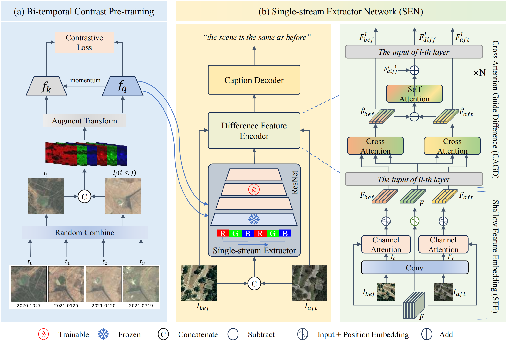

# Single-stream Extractor Network with Contrastive Pre-training for Remote Sensing Change Captioning

Author: Qing Zhou, Junyu Gao, Yuan Yuan, Qi Wang☨

> This repository is the official implementation of [SEN](https://ieeexplore.ieee.org/document/10530145) and also support RSICCformer, MCCFormer.



## Requirements

To install requirements:
```python
pip install -r requirements.txt
```

Download data form [LEVIR-CC](https://github.com/Chen-Yang-Liu/LEVIR-CC-Dataset) and put it in `./LEVIR_CC_dataset/`.:
- [Google Drive](https://drive.google.com/drive/folders/1cEv-BXISfWjw1RTzL39uBojH7atjLdCG?usp=sharing)
- [Baidu Pan](https://pan.baidu.com/s/1YrWcz090kdqOZ0lrbqXJJA) (code:nq9y)

Then preprocess dataset for training as follows:
```python
python create_input_files.py --min_word_freq 5
```

## Pre-trained models
You can download the pre-trained models from [Baidu Pan](https://pan.baidu.com/s/1tvQtgqJhk5Gp8foKoYapfg?pwd=icap), it includes the following weights:
- Trained models:
  - SEN with ResNet50 pre-trained 300 epochs on SSL4EO-S12.
  - MCCFormer-S/D with ResNet50 pre-trained on ImageNet.
  - RSICCformer<sub>c</sub> with ResNet101 pre-trained on ImageNet.
- Pre-trained extractor on SSL4EO-S12:
  - ResNet18
  - ResNet34
  - ResNet50
  - ResNet101


## Training

To train the SEN model, run this command:
```python
CUDA_VISIBLE_DEVICES=0 python train.py \
  --more_reproducibility \
  --savepath model_checkpoints/SEN --model SEN \
  --batch_size 128 --proj_channel 512 \
  --encoder_n_layers 2 --ft_layer 4 --model_stage 4 \
  --weight_path pretrain_ckpt/rn50.pth.tar
```

To train the RSICCformer model, run this command:
```python
CUDA_VISIBLE_DEVICES=0 python train.py \
  --more_reproducibility \
  --savepath model_checkpoints/RSICCformer --model RSICCformer \
  --batch_size 128 --encoder_image resnet101 \
  --encoder_feat MCCFormers_diff_as_Q --decoder trans
```

To train the MCCFormer-S/D model, run this command:
```python
CUDA_VISIBLE_DEVICES=0 python train.py \
  --more_reproducibility \
  --savepath model_checkpoints/MCCFormer-S --model RSICCformer \
  --batch_size 128 --encoder_image resnet101 \
  --encoder_feat MCCFormers-S --decoder trans \
  --n_layer 2 --n_heads 4 --decoder_n_layers 2
```


## Evaluation

To evaluate the SEN model, run:
```python
python eval.py --path ./models_checkpoint/SEN/ --model SEN
```

To evaluate the RSICCformer, MCCFormer-S/D model, run:
```python
python eval.py --path ./models_checkpoint/RSICCformer/ --model RSICCformer
```


## Result
| Method | B@1 | B@2 | B@3 | B@4 | M | R | C | S<sup>∗</sup><sub>𝑚</sub> | P | FPS |
| ------ | ------ | ------ | ------ | ------ | ------ | ------- | ----- | ---- | ---------- | --- |
| Capt-Rep-Diff | 72.90 | 61.98 | 53.62 | 47.41 | 34.47 | 65.64 | 110.57 | 64.52 | - | - |
| Capt-Att | 77.64 | 67.40 | 59.24 | 53.15 | 36.58 | 69.73 | 121.22 | 70.17 | - | - |
| Capt-Dual-Att | 79.51 | 70.57 | 63.23 | 57.46 | 36.56 | 70.69 | 124.42 | 72.28 | - | - |
| DUDA | 81.44 | 72.22 | 64.24 | 57.79 | 37.15 | 71.04 | 124.32 | 72.58 | - | - |
| MCCFormer-S | 79.90 | 70.26 | 62.68 | 56.68 | 36.17 | 69.46 | 120.39 | 70.68 | 69.0 | 12.9 |
| MCCFormer-D | 80.42 | 70.87 | 62.86 | 56.38 | 37.29 | 70.32 | 124.44 | 72.11 | 69.0 | 12.4 |
| RSICCformer_c | 83.09 | 74.32 | 66.66 | 60.44 | 38.76 | 72.63 | 130.00 | 75.46 | 56.2 | 15.0 |
| PSNet | 83.86 | 75.13 | 67.89 | 62.11 | 38.80 | 73.60 | 132.62 | 76.78 | - | - |
| Δ | +1.24 | +1.92 | +2.12 | +1.98 | +0.79 | +0.97 | +3.40 | +1.79 | -16.3 | +8.7 |
| SEN (ours) | **85.10** | **77.05** | **70.01** | **64.09** | **39.59** | **74.57** | **136.02** | **78.57** | **39.9** | **23.7** |

## Citation
```
@ARTICLE{10530145,
  author={Zhou, Qing and Gao, Junyu and Yuan, Yuan and Wang, Qi},
  journal={IEEE Transactions on Geoscience and Remote Sensing}, 
  title={Single-Stream Extractor Network With Contrastive Pre-Training for Remote-Sensing Change Captioning}, 
  year={2024},
  volume={62},
  number={},
  pages={1-14},
}
```

## Reference
Thanks to the following repository: [RSICCformer](https://github.com/Chen-Yang-Liu/RSICC), [SSL4EO-S12](https://github.com/zhu-xlab/SSL4EO-S12)
